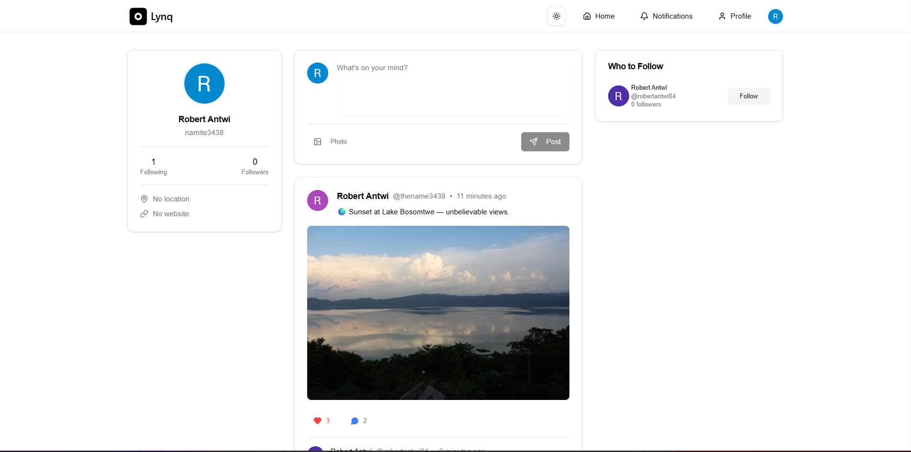

<a href="https://antwi-lynq.vercel.app" target="_blank">
    
</a>

# 📱 Lynq — Full-Stack Social Media Application

Lynq is a modern, full-stack social media platform built with **Next.js**, designed to deliver a seamless, fast, and secure social experience. It supports real-time interactions, user-generated content, notifications, authentication, and profile management — all wrapped in a clean, responsive UI.

This project demonstrates professional-level engineering, including backend APIs, authentication flows, image uploads, database management, UI/UX polish, and production deployment.

---

## ✨ Features

### 🔐 **Authentication & Security**
- Sign up / log in using **Google OAuth** or **Email + Password**
- Email login includes a **six-digit verification code** for enhanced security
- Fully managed authentication and user sessions via **Clerk**
- Account management:
  - Add/remove email addresses  
  - View connected accounts  
  - Review active devices  
  - Delete account  

---

### 📝 **Posts & Interactions**
- Create posts with **image uploads** using UploadThing
- Like and comment on posts with **instant UI updates**
- Beautiful, non-intrusive, animated notifications
- Delete your own posts with a confirmation dialog
- View:
  - Post details  
  - Likes  
  - Comments  

---

### 👥 **Social Features**
- Follow and unfollow users
- Intelligent **random user suggestions** to follow
- Visit any user profile to see:
  - Bio & profile info  
  - Posts  
  - Likes  
- Update your own profile details anytime

---

### 🔔 **Real-Time Notifications**
Get immediate notifications when:
- Someone follows you  
- Someone likes your post  
- Someone comments on your post  
Comments notifications link directly to:
- The post  
- The specific comment  

---

## 🏠 **User Flow Summary**
1. Start at the homepage  
2. Sign up or log in (Google or email-based)  
3. Create posts, upload images, interact with other users  
4. Follow profiles, explore suggestions, and manage your account  
5. Receive notifications for social interactions  
6. Log out securely at any time  

---

## 🛠️ **Tech Stack**

### 🚀 Frameworks & Languages
- **Next.js (App Router)**
- **React**
- **TypeScript**

### 🎨 Styling
- **TailwindCSS**
- **Shadcn/UI**
- Responsive, modern UI components

### 🔒 Authentication
- **Clerk** (OAuth, email verification, device/session management)

### 🗂️ Database & ORM
- **PostgreSQL** (Neon)
- **Prisma ORM**

### 🖼️ File Uploads
- **UploadThing** for secure image uploads

### ⚙️ Backend & Architecture
- **Server Components**
- **Server Actions**
- **Route Handlers (API)**
- **Dynamic & Static Routes**
- **Optimistic UI updates**
- **Caching, ISR, and Data Revalidation**

---

## 📦 Getting Started

### 1️⃣ Clone the repository
```bash
git clone https://github.com/antwirobert/lynq.git
cd lynq
```

### 2️⃣ Install dependencies
```bash
npm install
# or
yarn install
```
### 3️⃣ Set environment variables
```bash
NEXT_PUBLIC_CLERK_PUBLISHABLE_KEY=
CLERK_SECRET_KEY=
DATABASE_URL=
UPLOADTHING_TOKEN=
```
### 4️⃣ Start the development server
```bash
# Run the development server
npm run dev
# or
yarn dev
```

Open http://localhost:3000 in your browser to view the project.

<br />

🌐 Live Demo

Check out the live deployment: 
[Lynq](https://lync-social.vercel.app)

<br />

```txt
📁 Project Structure
src/
 ├─ app/
 │   ├─ (public)/
 │   ├─ (auth)/
 │   ├─ api/
 │   │   └─ posts/
 │   │       └─ route.ts
 │   ├─ dashboard/
 │   ├─ layout.tsx
 │   ├─ page.tsx
 │   ├─ loading.tsx
 │   ├─ error.tsx
 │   └─ not-found.tsx
 ├─ components/
 │   ├─ ui/
 │   └─ shared/
 ├─ lib/
 ├─ server/
 │   ├─ actions/
 │   └─ db.ts
 └─ styles/
```

<br />

🤝 Contributing

Contributions are welcome! Please submit an issue or pull request.

<br />

🧑‍💻 Author

Robert Antwi Creator of Lynq
[GitHub](https://github.com/antwirobert/) 
[LinkedIn](https://www.linkedin.com/in/robert-antwi-a0aab9277/)

<br />

⭐ Support the Project

If this project inspires you, please leave a star on the repo!
It helps more developers discover it.
